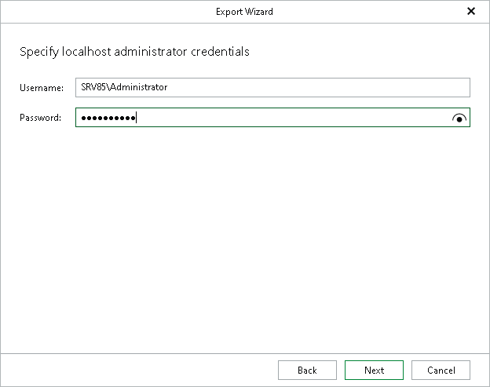
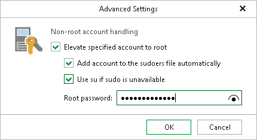
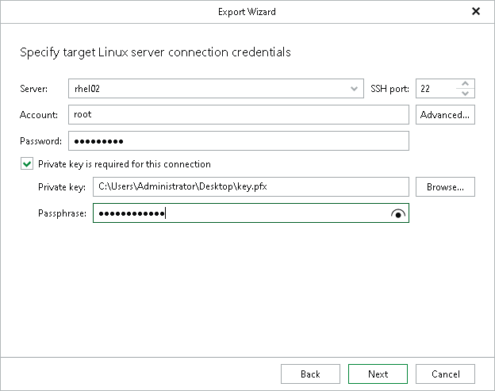

# Step 5. Specify Target Host Credentials

In this article

At this step of the wizard, specify connection settings required to access the target server for the export operation. The set of connection settings depends on whether you have chosen to export your databases to the local host (available for Windows-based backup servers only) or another Linux server.

[For Windows-Based Backup Servers] Local Host

This step of the wizard is available if you use a Windows-based backup server and you have selected to export your PostgreSQL databases to the local host where Veeam Explorer for PostgreSQL is running.

Enter the administrator credentials to connect to the local host where Veeam Explorer for PostgreSQL is running.

For more information on the required user account configuration, see the [Permissions](vep_permissions.md) section.

Linux Server

This step of the wizard is available if you have selected to export your PostgreSQL databases to a Linux server.

At this step of the wizard, specify credentials to access the target Linux server.

1. In the Server field, enter the DNS name or IP address of the target server.
2. In the SSH port field, specify an SSH port (by default, port 22 is used).
3. In the Account field, specify a Linux system account name under which to connect to the specified server. You can export data to a Linux server using an account that does not have root privileges on the target server.
4. If you need additional privileges for other operations and you want to elevate the specified account to root, click Advanced:

1. Select the Elevate specified account to root check box.

1. To add the user account to the sudoers file, select the Add account to the sudoers file automatically check box. In the Root password field, enter the password for the root account.

If you do not enable this option, you will have to manually add the user account to the sudoers file.

1. If you plan to use the account to connect to Linux servers where the sudo command is not available or may fail, you have an option to use the su command instead. To enable the su command, select the Use su if sudo is unavailable check box and in the Root password field, enter the password for the root account.

Veeam Backup & Replication will first try to use the sudo command. If the attempt fails, Veeam Backup & Replication will use the su command.

1. In the Password field, enter the account password.
2. If a private key is required to connect to the server, do the following:

1. Select the Private key is required for this connection check box.

1. In the Private key field, specify a file that contains a private key.

To locate a file, click Browse and select a key.

1. In the Passphrase field, enter the passphrase used to decrypt the private key.

Page updated 10/31/2025

Page content applies to build 13.0.1.1071
