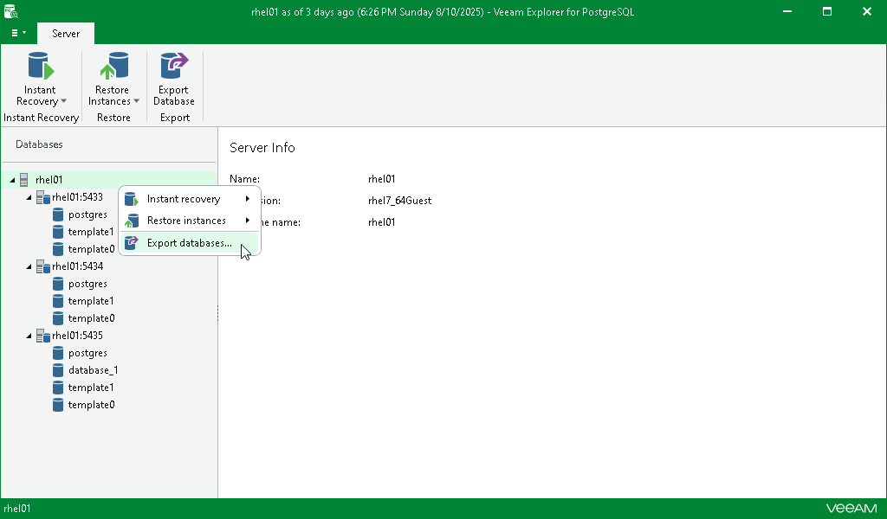

# Step 1. Launch Export Wizard

To launch the Export wizard, do the following:

1. In the navigation pane, select a database, instance or the server.
2. On the Database, Instance or Server tab, select Export databases.

Alternatively, right-click a database, instance or the server and select Export databases.

