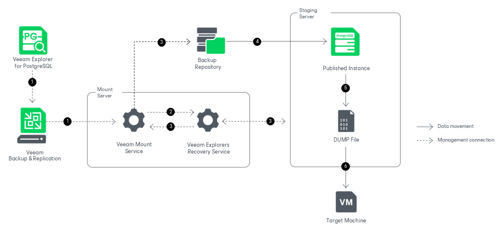

# How Export Works

Exporting PostgreSQL databases with Veeam Explorer for PostgreSQL works in the following manner:

1. To start the export process, Veeam Explorer for PostgreSQL sends an export command to the Veeam Mount Service. The service runs on the mount server associated with the backup repository.
2. The Veeam Mount Service delegates this request to the Veeam Explorers Recovery Service running on the same server.
3. The Veeam Explorers Recovery Service connects to the staging server (or the target server for the publishing operation when exporting from a published instance). The service validates the permissions of the selected user and checks if there is enough free space on the staging server and the target machine.

Some aspects of the validation process vary depending on the operating system of the PostgreSQL machine.

* For Windows machines, Veeam Explorer for PostgreSQL uses the Veeam PostgreSQL Restore Service on the staging server. This persistent component checks the valid rights assignments required for export, gets information about the databases, and later performs the required file operations.
* For Linux machines, the Veeam Explorers Recovery Service performs the necessary validations, for example, validating the SSH fingerprints of the staging server, without using a persistent component.

The Veeam Explorers Recovery Service sends a request to the Veeam Mount Service to connect to the backup repository and initiate the mounting operation.

1. The Veeam Mount Service mounts the necessary file system from the backup repository to the C:\VeeamFLR directory for Windows machines or the /run/media directory for Linux machines on the staging server. For more information, see [How Mounting Works](vep_mount.md). Veeam Explorers Recovery Service starts the instance from the mounted file system.
2. Using the pg\_dump utility, the Veeam Explorers Recovery Service saves the selected databases to a temporary directory on the staging server. For Windows machines, the databases are saved to the C:\WINDOWS\SystemTemp\VePgExport directory. For Linux machines, the service scans the /var/tmp and /tmp directories and saves the databases to the directory that has more available space. The output of the export operation is a DUMP file in the directory format (-Fd option).

Note that when exporting a database from a published instance, the DUMP file is saved directly to the server onto which the instance is published and it does not require a staging server. For more information, see [Exporting From Published Instances](vep_published_export.md).

1. The Veeam Explorers Recovery Service sends the DUMP file to the target machine, which can be either a Windows machine (available for Windows-based backup servers only) or a Linux machine. Data transfer is established by data movers running on the staging server (target server for the publishing operation if exporting from a published instance) and the target machine.

The export session is resilient to network disruptions, backup server or mount server crashes. If anything disrupts the export process, you can launch retry after the server or network is up.

After the export operation successfully completes, Veeam Explorer for PostgreSQL removes the DUMP file from the C:\WINDOWS\SystemTemp\VePgExport directory (for Windows machines) or the /var/tmp or /tmp directory (for Linux machines) on the staging server and drops the published instance.

You can save the exported DUMP file to the necessary PostgreSQL server and restore it with the pg\_restore utility. For more information about restoring DUMP files, see [Restoring Exported Database](vep_export_restore_exported_databases.md).

Page updated 2026-07-24

