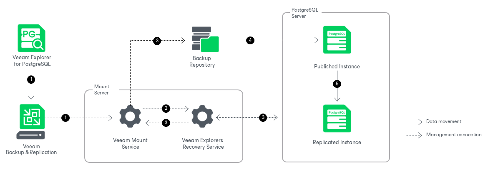

# How Instant Recovery Works

In this article

Instant recovery of PostgreSQL instances with Veeam Explorer for PostgreSQL works in the following manner:

1. To start the instant recovery process, Veeam Explorer for PostgreSQL sends an instant recovery command to the Veeam Mount Service. The service runs on the mount server associated with the backup repository.
2. The Veeam Mount Service delegates this request to the Veeam Explorers Recovery Service running on the same server.
3. The Veeam Explorers Recovery Service connects to the target server. The service validates the permissions of the selected user and checks if there is enough free space on the target server. The Veeam Explorers Recovery Service sends a request to the Veeam Mount Service to connect to the backup repository and initiate the mounting operation.
4. The Veeam Mount Service uses FUSE to mount the necessary file system from the backup repository to the /run/media directory on the target PostgreSQL machine. The Veeam Explorers Recovery Service starts the instance from the mounted file system.

1. The Veeam Explorers Recovery Service replicates the published instance on the target server using the pg\_basebackup utility. All changes in instance files that occur after publishing are saved in the instant recovery write cache, which is stored in the /var/lib/veeam/IRCache folder on the mount server. The standby instance is continuously synchronized with the changes on the published instance.

After the instances are fully synchronized, you can switch over to the up-to-date standby instance on the production server. For more information on the available switchover options, see [Switchover](vep_ir_switchover.md).

During switchover, the Veeam Explorers Recovery Service does the following:

1. Switches the published instance to the read-only mode.
2. Synchronizes the remaining differences between the published instance and the standby instance on the target server.
3. Turns off the published and the standby instance.
4. Starts the standby instance as a standalone instance.

The instant recovery session is resilient to network disruptions, backup server or mount server crashes. If anything disrupts the instant recovery process, the process stays in the waiting mode and performs 10 automatic retries every 5 minutes. If the retries fail, you can launch retry after the server or network is up.

Page updated 8/29/2025

Page content applies to build 13.0.1.1071
