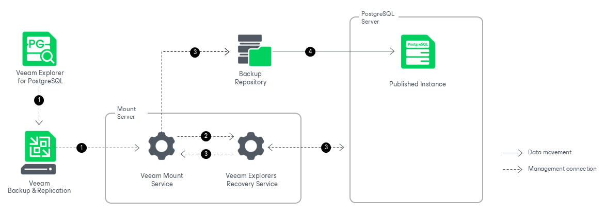

# How Publishing Works

In this article

Publishing PostgreSQL instances with Veeam Explorer for PostgreSQL works in the following manner:

1. To start the publishing process, Veeam Explorer for PostgreSQL sends a publishing command to the Veeam Mount Service. The service runs on the mount server associated with the backup repository.
2. The Veeam Mount Service delegates this request to the Veeam Explorers Recovery Service running on the same server.
3. The Veeam Explorers Recovery Service connects to the target server. The service validates the permissions of the selected user and checks if there is enough free space on the target server. The Veeam Explorers Recovery Service sends a request to the Veeam Mount Service to connect to the backup repository and initiate the mounting operation.
4. The Veeam Mount Service uses FUSE to mount the necessary file system from the backup repository to the /run/media directory on the target PostgreSQL machine. The Veeam Explorers Recovery Service opens the instance from the mounted file system, so that you can perform the required operations with PostgreSQL tools.

All changes in instance files that occur after publishing are saved in the publishing write cache, which is stored in the /var/lib/veeam/IRCache folder on the mount server.

After you have launched a publishing operation to a PostgreSQL server, you can quickly republish the latest or point-in-time state of the PostgreSQL instance to the same server.

The publishing session is resilient to network disruption, backup server or mount server crashes. If anything disrupts the publishing process (the target or mount server crashes, or the network is down), you can launch the retry manually after the server or network is up.

Once the publishing operation is completed, you can export the modified databases managed by the published instance. For more information, see [Exporting From Published Instances](vep_published_export.md).

Page updated 8/29/2025

Page content applies to build 13.0.1.1071
