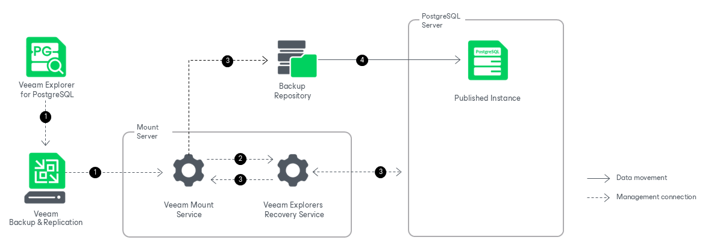

# How Publishing Works

Publishing PostgreSQL instances with Veeam Explorer for PostgreSQL works in the following manner:

1. To start the publishing process, Veeam Explorer for PostgreSQL sends a publishing command to the Veeam Mount Service. The service runs on the mount server associated with the backup repository.
2. The Veeam Mount Service delegates this request to the Veeam Explorers Recovery Service running on the same server.
3. The Veeam Explorers Recovery Service connects to the target server. The service validates the permissions of the selected user and checks if there is enough free space on the target server.

Some aspects of the validation process vary depending on the operating system of the PostgreSQL machine.

* For Windows machines, Veeam Explorer for PostgreSQL uses the Veeam PostgreSQL Restore Service on the target server. This persistent component checks the valid rights assignments required for database recovery, gets information about the PostgreSQL instances, and later performs the required database operations.
* For Linux machines, the Veeam Explorers Recovery Service performs the necessary validations, for example, validating the SSH fingerprints of the target server, without using a persistent component.

The Veeam Explorers Recovery Service sends a request to the Veeam Mount Service to connect to the backup repository and initiate the mounting operation.

1. The Veeam Mount Service mounts the necessary file system from the backup repository to the C:\VeeamFLR directory for Windows machines or the /run/media directory for Linux machines. For more information, see [How Mounting Works](vep_mount.md). The Veeam Explorers Recovery Service opens the instance from the mounted file system, so that you can perform the required operations with PostgreSQL tools.

All changes in instance files that occur after publishing are saved in the publishing write cache, which is stored in the /var/lib/veeam/IRCache folder (for Linux machines) or the C:\ProgramData\Veeam\Backup\IRCache folder (for Windows machines) on the mount server.

After you have launched a publishing operation to a PostgreSQL server, you can quickly republish the latest or point-in-time state of the PostgreSQL instance to the same server.

The publishing session is resilient to network disruption, backup server or mount server crashes. If anything disrupts the publishing process (the target or mount server crashes, or the network is down), you can launch the retry manually after the server or network is up.

Once the publishing operation is completed, you can export the modified databases managed by the published instance. For more information, see [Exporting From Published Instances](vep_published_export.md).

Page updated 2026-07-24

