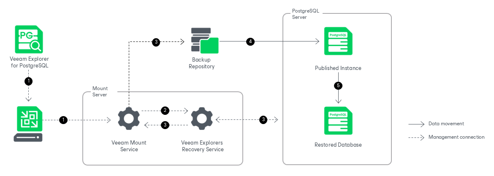

# How Restore Works

Instance Restore

Restoring PostgreSQL instances with Veeam Explorer for PostgreSQL works in the following manner:

1. Veeam Explorer for PostgreSQL connects to the target server and performs a series of validations. For example, it checks whether the target server has enough free space for the restored PostgreSQL instance.

Some aspects of the validation process vary depending on the operating system of the PostgreSQL machine.

* For Windows machines, Veeam Explorer for PostgreSQL uses the Veeam PostgreSQL Restore Service on the target server. This persistent component checks the valid rights assignments required for data recovery, gets information about the PostgreSQL instances, and later performs the required file operations, including copying the data directory and WAL files.
* For Linux machines, Veeam Explorer for PostgreSQL performs the necessary validations, for example, validating the SSH fingerprints of the target server, without using a persistent component.

1. Veeam Explorer for PostgreSQL sends a restore command to the Veeam Mount Service running on the mount server associated with the backup repository. The service connects to the backup repository and prepares the mounting operation.

1. The Veeam Mount Service mounts the necessary file system to the target PostgreSQL machine. Mounting is done to the C:\VeeamFLR directory for Windows machines or the /run/media directory for Linux machines. For more information, see [How Mounting Works](vep_mount.md).
2. The Veeam PostgreSQL Restore Service (for Windows machines) or Veeam Explorer for PostgreSQL itself (for Linux machines) copies the data directory and WAL files from the mounted file system to the native file system of the target machine. The service edits the postgresql.conf file with the selected restore settings, starts the instance and reverts the postgresql.conf file to its previous state.

The restore session is resilient to network disruption, backup server or mount server crashes. If anything disrupts the restore process (the target or mount server crashes, or the network is down), you can launch the retry manually after the server or network is up.

After the restore operation successfully completes, Veeam Explorer for PostgreSQL unmounts the mounted file system and if necessary, performs the post-restore actions selected at the [Specify Post-Restore Action](vep_restore_single_tas_specify_post_restore_action.md) step.

|  |
| --- |
| Note |
| PostgreSQL instances that belong to a Patroni high-availability cluster are restored as standalone instances. You can add a restored instance to a cluster manually, as described in the [Converting Restored Standalone Instance to Cluster](vep_restoring_instance_convert_to_cluster.md) section. |

Database Restore

Restoring individual PostgreSQL databases to Linux machines works in the following manner:

1. To start the restore process, Veeam Explorer for PostgreSQL sends a restore command to the Veeam Mount Service. The service runs on the mount server associated with the backup repository.
2. The Veeam Mount Service delegates this request to the Veeam Explorers Recovery Service running on the same server.
3. The Veeam Explorers Recovery Service connects to the target server. The service validates the permissions of the selected user, the specified PostgreSQL account, and the available free space on the target server. If a database with the same name already exists on the target server, you are prompted to overwrite it. The Veeam Explorers Recovery Service sends a request to the Veeam Mount Service to connect to the backup repository and initiate the mounting operation.
4. The Veeam Mount Service mounts the necessary file system from the backup repository to the /run/media directory on the target server, and the Veeam Explorers Recovery Service starts a published instance from the mounted file system. For more information, see [How Publishing Works](vep_how_publishing_works.md).
5. The Veeam Explorers Recovery Service uses native PostgreSQL utilities to restore the selected databases to the target server.

1. The service uses pg\_dump to export the selected databases from the published instance to the standard output (stdout).
2. The service uses pg\_restore to restore the selected databases from the standard input (stdin) into the target PostgreSQL instance. The pg\_dump and pg\_restore operations run as a single pipeline, so no intermediary DUMP file is created. If you specified a new name, the database is restored under that name.

After the restore operation successfully completes, Veeam Explorer for PostgreSQL drops the published instance.

|  |
| --- |
| Note |
| Individual database restore targets an existing PostgreSQL instance. You can restore databases directly to an instance that belongs to a Patroni high-availability cluster. |

Page updated 2026-07-24

