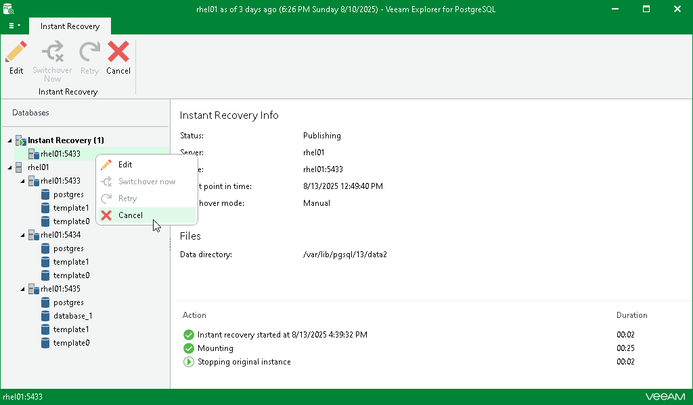
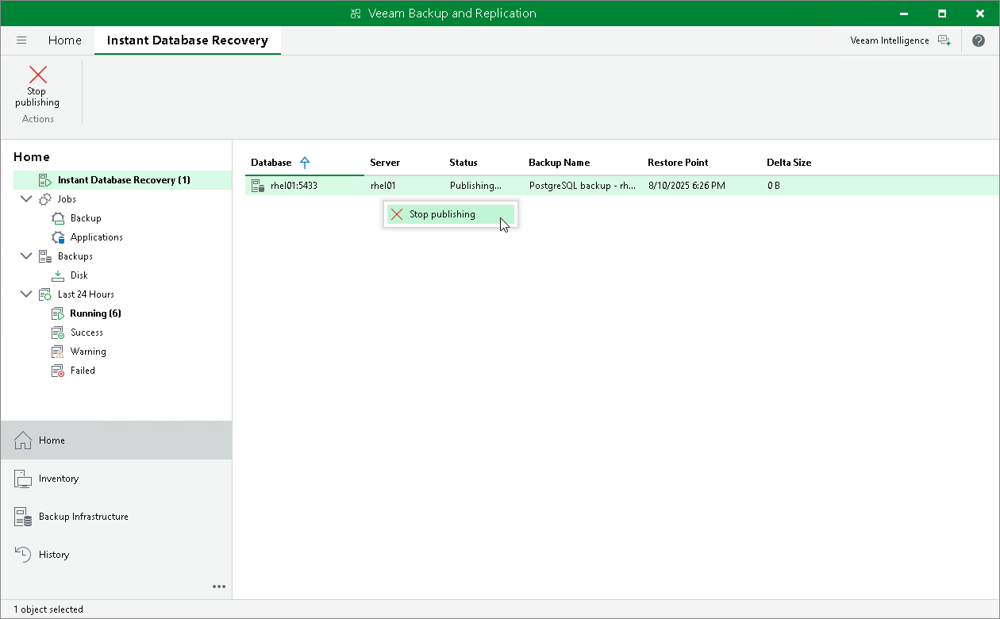

# Canceling Instant Recovery

If you have finished working with the published instance and you do not want to switch over to it, you can cancel the instant recovery session.

You can do this by canceling instant recovery in either Veeam Explorer for PostgreSQL or the Veeam Backup & Replication console.

|  |
| --- |
| Note |
| Consider the following:   * Closing either the Veeam Explorer for PostgreSQL window or the Veeam Backup & Replication console does not cancel the instant recovery session. * You do not need to cancel the instant recovery session if switchover is already performed. The session closes automatically after switchover. |

Canceling Instant Recovery in Veeam Explorer for PostgreSQL

To cancel the instant recovery session in Veeam Explorer for PostgreSQL, do the following:

1. In the navigation pane, under the Instant Recovery node, select an instance with an active instant recovery session.
2. On the Instant Recovery tab, select Cancel.

Alternatively, you can right-click the instance and select Cancel.

Canceling Instant Recovery in Veeam Backup & Replication Console

To cancel the instant recovery session in the Veeam Backup & Replication console, do the following:

1. In the Veeam Backup & Replication console, open the Home view.
2. In the navigation pane, select Instant Database Recovery.
3. In the preview pane, select the session and in the Instant Database Recovery tab click Stop Publishing.

Alternatively, you can right-click the session and click Stop publishing.

