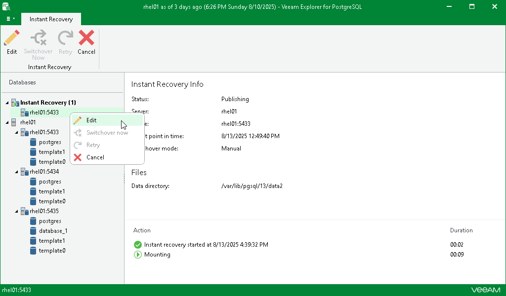
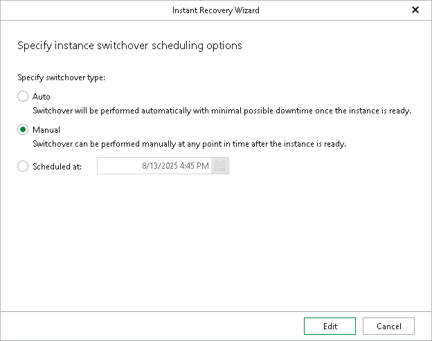

# Editing Instant Recovery Settings

In this article

If you have started an instant recovery session and you want to perform switchover with different settings than the ones you originally specified, you can edit the instant recovery settings.

To change the switchover settings of an instant recovery session, do the following:

1. In the navigation pane, under the Instant Recovery node, select an instance with an active instant recovery session.
2. On the Instant Recovery tab, select Edit or right-click the instance and select Edit.

1. Change the switchover option and click Edit to save the new switchover settings.

Page updated 8/13/2025

Page content applies to build 13.0.1.1071
