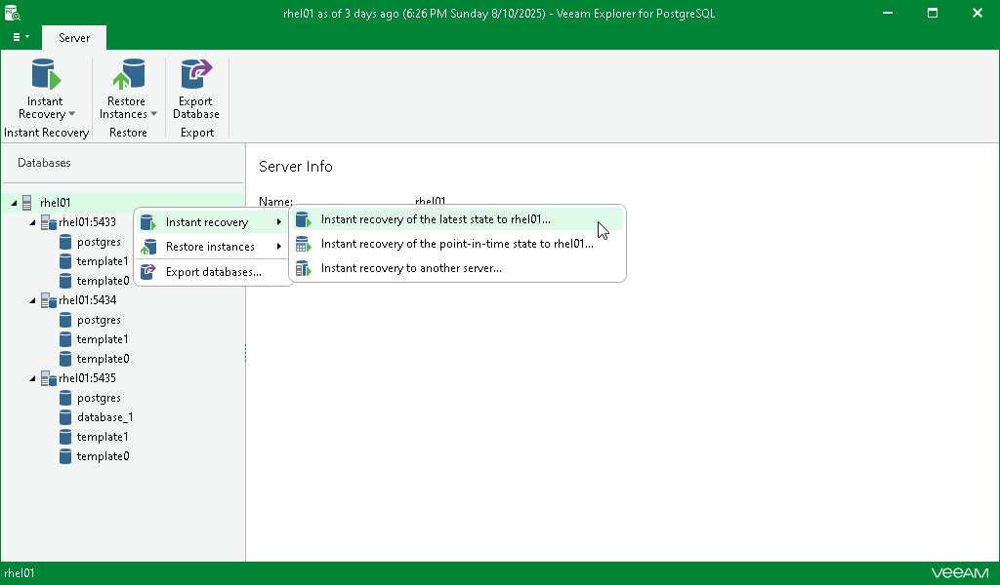

# Step 1. Launch Instant Recovery Wizard

To launch the Instant Recovery wizard, do the following:

1. In the navigation pane, select the server.
2. On the Server tab, select Instant Recovery > Instant recovery of the latest state to <original\_location>.

Alternatively, you can right-click the server and select Instant recovery > Instant recovery of the latest state to <original\_location>.

|  |
| --- |
| Note |
| The name of the instant recovery option depends on the restore point you select during the [application item restore](restore_veeam_explorers.md) process in the Veeam Backup & Replication console.   * If you select the most recent available restore point, the option name is displayed as Instant recovery of the latest state to <original\_location>. * If you select any other restore point, the option name is displayed as Instant recovery of the state of <point\_in\_time> to <original\_location>. |

