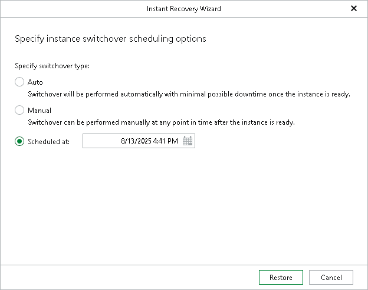

# Step 3. Specify Switchover Settings

In this article

At this step of the wizard, specify an instance switchover type. During switchover, the mounted instance is switched to its complete copy on the target server.

To select a switchover type and start an instant recovery session, do the following:

1. At the Specify switchover type field, select one of the following switchover options:

* Auto: switchover is performed automatically after all instance files are copied and synchronized.
* Manual: switchover is started manually by the user at any time after all instances files copied and synchronized.

* Scheduled: switchover is performed at a specified date and time. Use the drop-down calendar to specify the date and time.

1. Click Restore.

After you click Restore, Veeam Explorer for PostgreSQL starts publishing the instance on the target server.

Page updated 10/6/2025

Page content applies to build 13.0.1.1071
