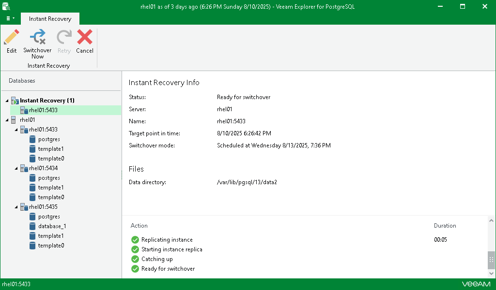

# Step 3. Finalize Instant Recovery Session

After you finish steps of the Instant Recovery wizard, Veeam Explorer for PostgreSQL starts an instant recovery session.

In the Instant Recovery session view, you can see the progress of the recovery, edit switchover settings, retry instant recovery and cancel instant recovery. For more information, see [Managing Instant Recovery Session](vep_ir_managing_session.md).

Depending on the selected switchover option, switchover starts in one of the following ways:

* Automatically, immediately after synchronization
* Automatically, according to a specified schedule
* Manually, anytime after synchronization

If you have selected the Manual switchover option, you must perform switchover manually as described in [Starting Switchover Manually](vep_ir_switchover_manual.md).

If switchover is successfully performed or the instant recovery session is canceled, the instance moves from the Instant Recovery node to the Completed node at the bottom of the navigation pane.

Related Topics

* [Managing Instant Recovery Session](vep_ir_managing_session.md)
* [Switchover](vep_ir_switchover.md)

