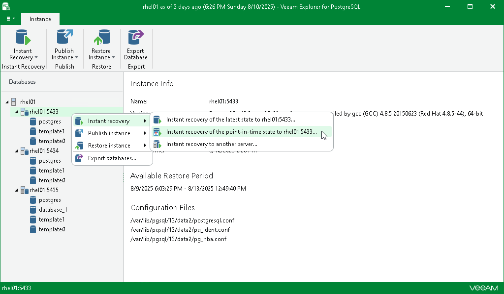

# Step 1. Launch Instant Recovery Wizard

To launch the Instant Recovery wizard, do the following:

1. In the navigation pane, select an instance.
2. On the Instance tab, select Instant Recovery > Instant recovery of the point-in-time state to <original\_location>.

Alternatively, you can right-click an instance and select Instant recovery > Instant recovery of the point-in-time state to <original\_location>.

