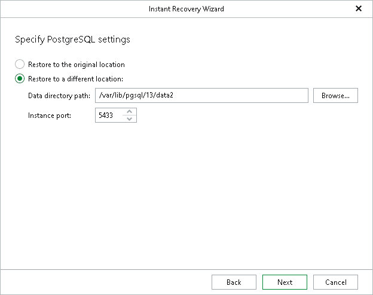

# Step 4. Specify PostgreSQL Settings

At this step of the wizard, specify the following PostgreSQL settings:

1. Specify a location to which you want to restore the PostgreSQL instance:

* Select Restore to the original location to restore the PostgreSQL instance to the original data directory.
* Select Restore to a different location and specify a path in the Data directory path field to restore the PostgreSQL instance to another directory. To locate a new directory, click Browse and select a folder you want to use.

1. In the Instance port field, specify a free instance port, which will also serve as an instance identifier.

|  |
| --- |
| Note |
| If the target data directory is not empty, you will be prompted to overwrite it before proceeding to the next step. |

