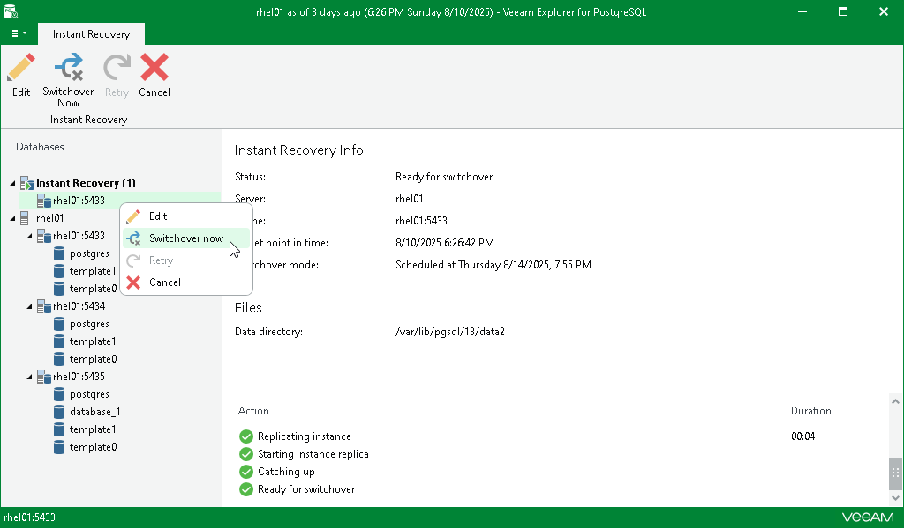

# Starting Switchover Manually

If you have selected the Manual switchover option in the Instant Recovery wizard, you can start the switchover process at any time if the instance is in the Ready to switchover state.

To start switchover manually, do the following:

1. In the navigation pane, under the Instant Recovery node, select a published instance.
2. On the Instant Recovery tab, select Switchover now.

Alternatively, you can right-click the instance and select Switchover now.

