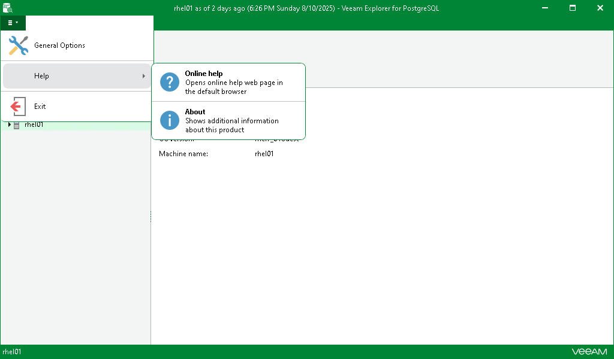
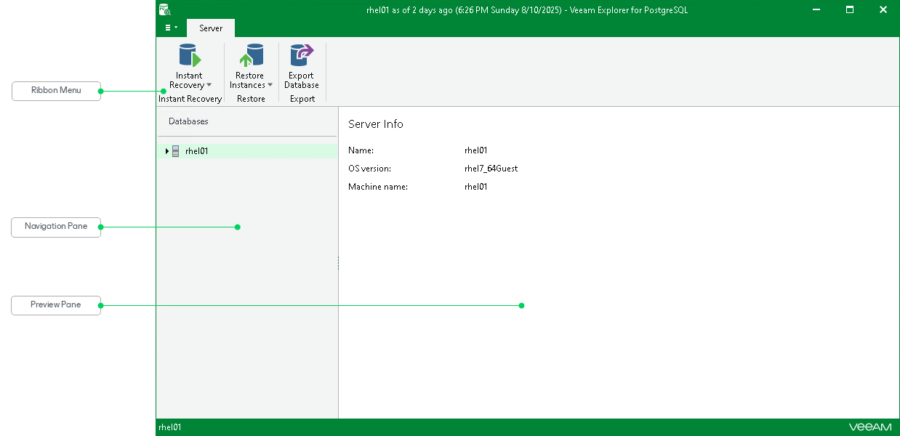

# Getting to Know User Interface

In this article

The user interface of Veeam Explorer for PostgreSQL is designed to let you quickly find commands that you need to restore PostgreSQL instances from backups.

Main Menu

The main menu comprises the following options:

* General Options. Allows you to enable extended logging. For more information, see [Enabling Extended Logging](vep_extended.md).

* Help.

* Online help. Opens the online help page.
* About. Shows the additional information including build number.

* Exit. Closes the Veeam Explorer for PostgreSQL window.

|  |
| --- |
| Tip |
| To open online help, press [F1] in any Veeam Explorer for PostgreSQL wizard or window. You will then be redirected to the relevant section of the user guide. |

Main Application Window

The main application window contains the following UI elements:

* The ribbon menu, which contains operation commands organized into logical groups represented as tabs. The ribbon is displayed at the top of the main application window.

* The navigation pane, which allows you to browse through the hierarchy of folders with backed-up data.
* The preview pane, which allows you to view details about items that are contained in a folder you have selected in the navigation pane.

Page updated 7/23/2024

Page content applies to build 13.0.1.1071
