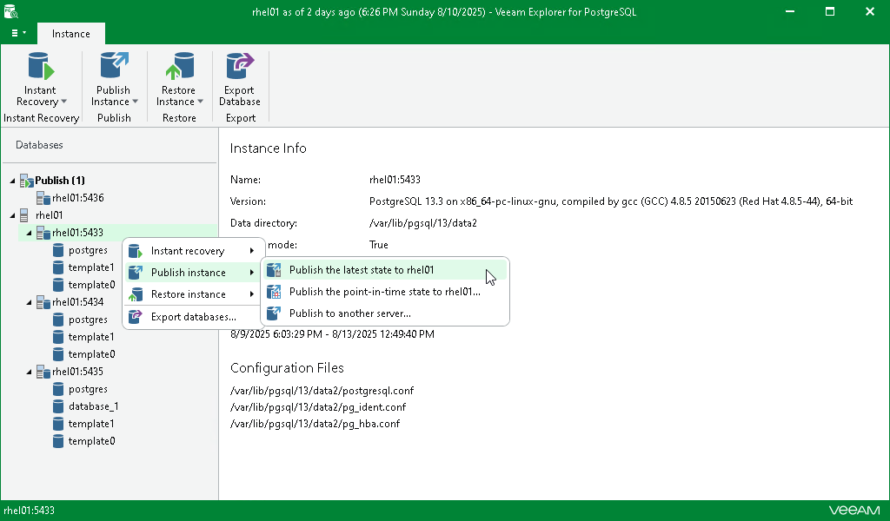

# Publishing Latest State

In this article

You can republish an unpublished instance anew. When republishing an instance, it will be attached to the target PostgreSQL server as of the latest available state.

To republish an instance as of the latest state, do the following:

1. In the navigation pane, select a PostgreSQL instance you want to republish.
2. On the Instance tab, select Publish Instance > Publish latest state to <target\_server>.

Alternatively, you can right-click an instance and select Publish instance > Publish latest state to <target\_server>.

|  |
| --- |
| Note |
| The name of the publish option depends on the restore point you select during the [application item restore](restore_veeam_explorers.md) process in the Veeam Backup & Replication console.   * If you select the most recent available restore point, the option name is displayed as Publish latest state to <target\_server>. * If you select any other restore point, the option name is displayed as Publish state of <point\_in\_time> to <target\_server>. |

Once completed, the instance will be published with the same settings as you specified during the [initial](vep_ptsr.md) publishing session.

Page updated 8/13/2025

Page content applies to build 13.0.1.1071
