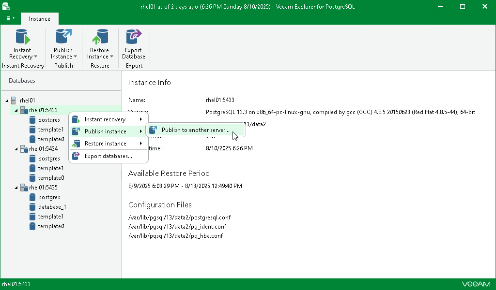

# Step 1. Launch Publish Wizard

To launch the Publish wizard, do the following:

1. In the navigation pane, select a PostgreSQL instance you want to publish.
2. On the Instance tab, select Publish Instance > Publish to another server.

Alternatively, you can right-click an instance and select Publish Instance > Publish to another server.

