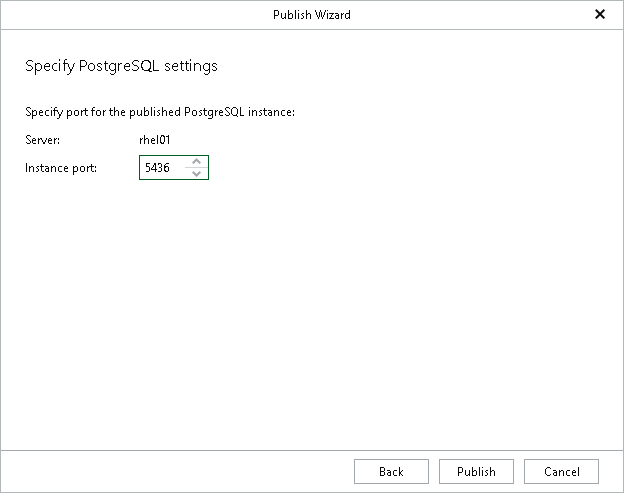

# Step 4. Specify PostgreSQL Settings

At this step of the wizard, specify a free PostgreSQL instance port in the Instance port field and click Publish.

The specified port must be free. If the port is occupied, Veeam Explorer for PostgreSQL will display an error.

