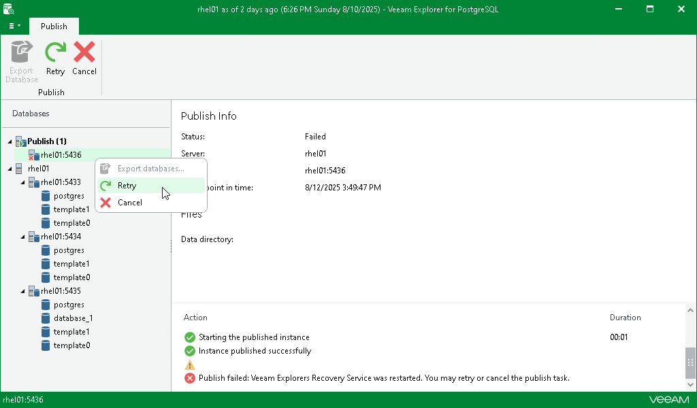

# Retrying Publishing

In this article

If anything disrupts the publishing process (the target or mount server crashes or the network is down), the restore process stays in the waiting mode and performs 10 automatic retries every 5 minutes. If the retries fail, you can launch the retry manually after the server or network is up.

To start the retry process manually, do the following:

1. In the navigation pane, under the Publish node, select the instance.
2. On the Publish tab, click Retry.

Alternatively, you can right-click the instance and select Retry.

Page updated 12/6/2023

Page content applies to build 13.0.1.1071
