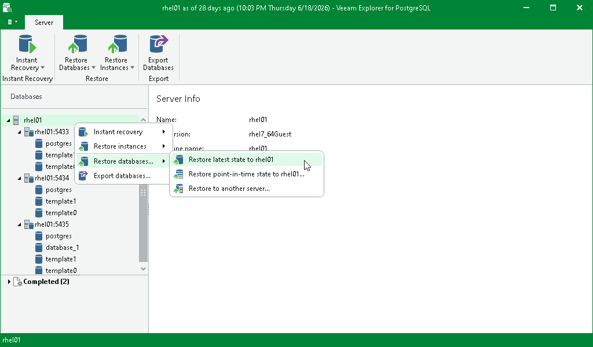

# Step 1. Launch Restore Wizard

To restore the latest state of the PostgreSQL server, do the following:

1. In the navigation pane, select the PostgreSQL server or an instance.
2. On the Server or Instance tab, select Restore Databases > Restore latest state to <original\_location>.

Alternatively, you can right-click the server or an instance and select Restore Databases > Restore latest state to <original\_location>.

|  |
| --- |
| Note |
| The name of the restore option depends on the restore point you select during the [application item restore](restore_veeam_explorers.md) process in the Veeam Backup & Replication console.   * If you select the most recent available restore point, the option name is displayed as Restore latest state to <original\_location>. * If you select any other restore point, the option name is displayed as Restore state of <point\_in\_time> to <original\_location>. |

Page updated 2026-07-20

