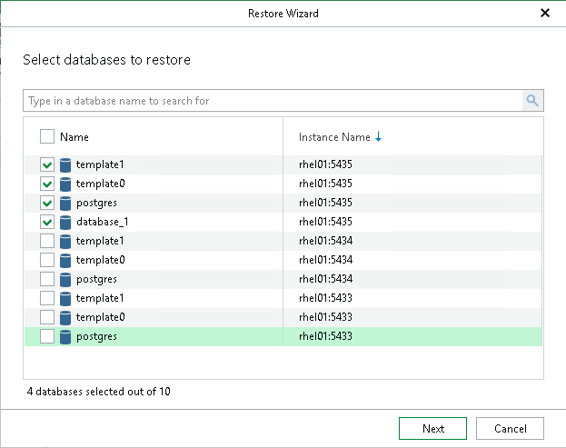

# Step 2. Select Databases

At this step of the wizard, select the databases that you want to restore.

To quickly find the necessary databases, use the search field or sort the databases by name. If the databases belong to multiple instances, you can also sort the databases by instance name.

|  |
| --- |
| Note |
| Veeam Explorer for PostgreSQL restores data to the same data directories and tablespace directories as on the backup file. If any of the target data or tablespace directories are not empty, you will be prompted to overwrite them. |

Page updated 2026-07-29

