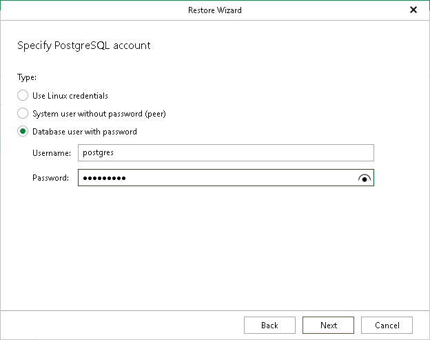

# Step 5. Specify Database Account

At this step of the wizard, specify a PostgreSQL account to use for authentication:

* Select Use Linux credentials to use the credentials of the Linux system user.
* Select System user without password (peer) to use peer authentication. With peer authentication, no password is required.
* Select Database user with password and specify the following:

1. In the Username field, enter the PostgreSQL user name.
2. In the Password field, enter the password for the specified user.

Page updated 2026-04-17

