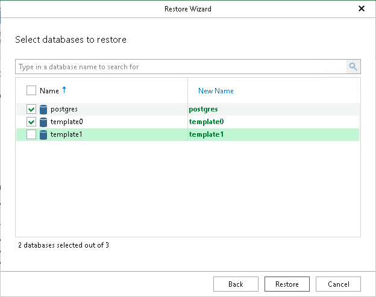

# Step 6. Specify Database Names

At this step of the wizard, select the databases to restore and optionally specify new names.

To quickly find the necessary databases, use the search field or sort the databases by name. If you launch the Restore wizard from the Server tab or by right-clicking a server, there is a third column with the instance name of each database, and you can also sort the databases by instance name.

1. Select the check boxes next to the databases you want to restore.
2. In the New Name column, enter new names for the databases.
3. Click Restore.

|  |
| --- |
| Note |
| When restoring multiple databases to another server, Veeam Explorer for PostgreSQL restores data to the same data directories and tablespace directories as on the backup file. If any of the target data or tablespace directories are not empty, you will be prompted to overwrite them. |

Page updated 2026-07-29

