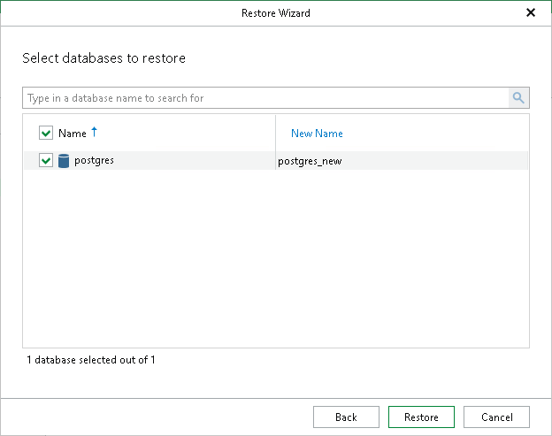

# Step 6. Specify Database Name

At this step of the wizard, review the database to restore and optionally specify a new name.

1. In the New Name column, enter a new name for the database.
2. Click Restore.

|  |
| --- |
| Note |
| If a database with the same name exists on the server, you will be prompted to overwrite it. |

Page updated 2026-07-29

