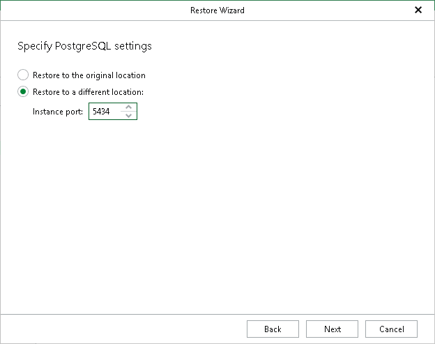

# Step 4. Specify PostgreSQL Settings

At this step of the wizard, specify the following PostgreSQL settings:

1. Specify a location to which you want to restore the PostgreSQL instance:

* Select Restore to the original location to restore the PostgreSQL instance to the original data directory.
* Select Restore to a different location to restore the PostgreSQL instance to a different location.

If you selected Restore to a different location, in the Instance port field, specify an instance port, which will also serve as an instance identifier. The port must be free.

Page updated 2026-07-29

