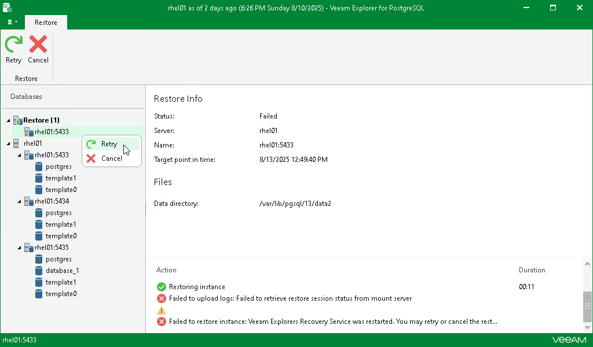
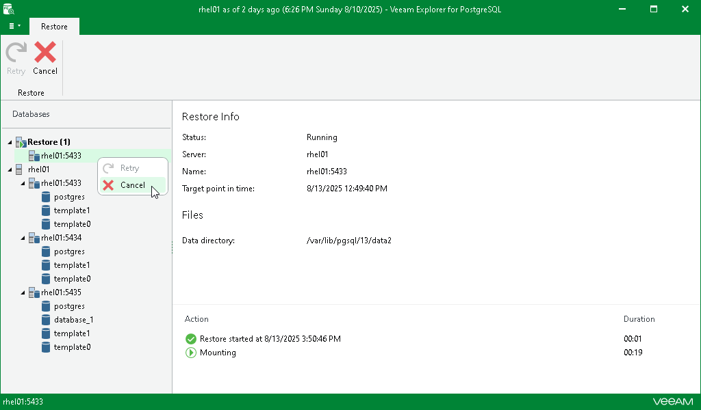

# Managing Restore Session

After you finish the steps of the Restore wizard, Veeam Explorer for PostgreSQL starts a restore session for each of the selected instances.

Under the Restore node in the upper part of the navigation pane, you can find the instances with an ongoing restore process. Click an instance to get a more detailed overview of the progress of its restore session in the preview pane.

If the restore process completes successfully or you cancel it, the instance moves to the Completed node in the bottom section of the navigation pane.

At this step, you can also manually retry the restore session if something interrupts it, or cancel the session.

Retrying Restore

If anything disrupts the restore process (the target or mount server crashes or the network is down), the restore process stays in the waiting mode and performs 10 automatic retries every 5 minutes. If the retries fail, you can launch the retry manually after the server or network is up. You cannot manually launch retry of an ongoing restore session.

To retry one or all ongoing restore sessions, do the following:

1. In the navigation pane, click the Restore node to select all ongoing restore sessions, or select the relevant instance.
2. On the Restore tab, select Retry.

Alternatively, you can right-click the Restore node or the relevant instance and select Retry.

Canceling Restore

To cancel one or all ongoing restore sessions, do the following:

1. In the navigation pane, click the Restore node to select all ongoing export sessions, or select the relevant instance.
2. On the Restore tab, select Cancel.

Alternatively, you can right-click the Restore node or the relevant instance and select Cancel.

