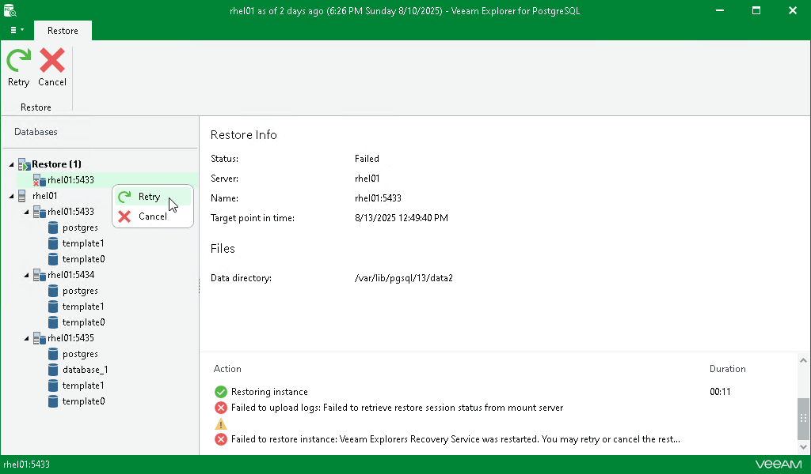
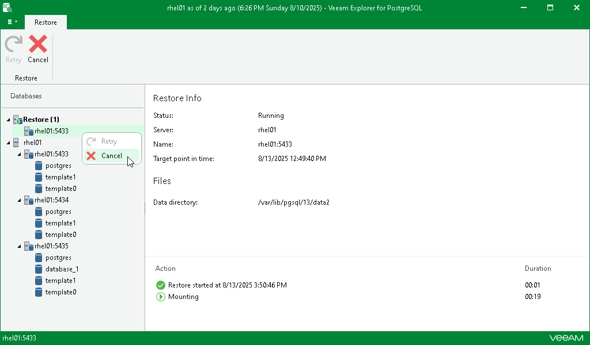

# Managing Restore Session

After you finish the steps of the Restore wizard, Veeam Explorer for PostgreSQL starts a restore session for the selected instances or databases.

Under the Restore node (for instance restore) or Database Restore (for database restore) in the upper part of the navigation pane, you can find the instances or databases with an ongoing restore process. Click an instance or a database to get a more detailed overview of the progress of its restore session in the preview pane.

If the restore process completes successfully or you cancel it, the instance or database moves to the Completed node in the bottom section of the navigation pane.

At this step, you can manually retry restore sessions if something interrupts them (for instance restore), or you can cancel the session.

Retrying Restore

If anything disrupts the restore process (the target or mount server crashes or the network is down), the restore process stays in waiting mode and performs 10 automatic retries every 5 minutes. If the retries fail, you can retry the session manually after the server or network is up. You cannot manually retry an ongoing restore session.

|  |
| --- |
| Note |
| You can retry instance restore sessions only. You cannot retry a database restore session. |

To retry one or all ongoing restore sessions, do the following:

1. In the navigation pane, click the Restore node to select all ongoing restore sessions, or select the relevant instance.
2. On the Restore tab in the ribbon menu, select Retry.

Alternatively, you can right-click the Restore node or the relevant instance and select Retry.

Canceling Restore

To cancel one or all ongoing restore sessions, do the following:

1. In the navigation pane, click the Restore or Database Restore node to select all ongoing restore sessions, or select the relevant instance or database.
2. On the Restore tab in the ribbon menu, select Cancel.

Alternatively, you can right-click the Restore or Database Restore node or the relevant instance or database and select Cancel.

Page updated 2026-07-29

