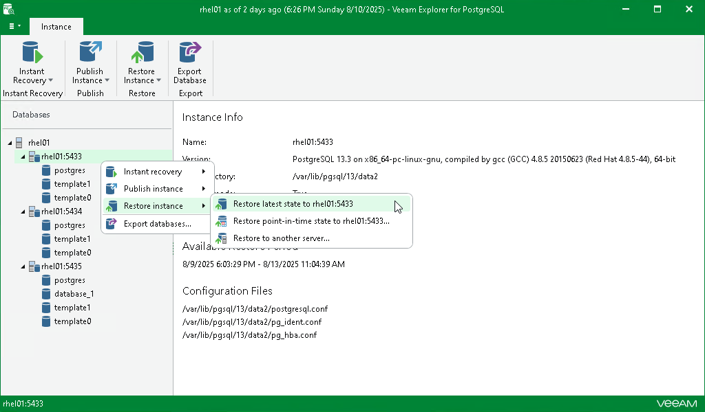

# Restoring Latest State

In this article

To restore the latest state of the PostgreSQL server, do the following:

1. In the navigation pane, select the PostgreSQL server.
2. On the Server tab, select Restore Instances > Restore latest state to <original\_location>.

Alternatively, you can right-click the server and select Restore instances > Restore latest state to <original\_location>.

|  |
| --- |
| Note |
| The name of the restore option depends on the restore point you select during the [application item restore](restore_veeam_explorers.md) process in the Veeam Backup & Replication console.   * If you select the most recent available restore point, the option name is displayed as Restore latest state to <original\_location>. * If you select any other restore point, the option name is displayed as Restore state of <point\_in\_time> to <original\_location>. |

Page updated 8/13/2025

Page content applies to build 13.0.1.1071
