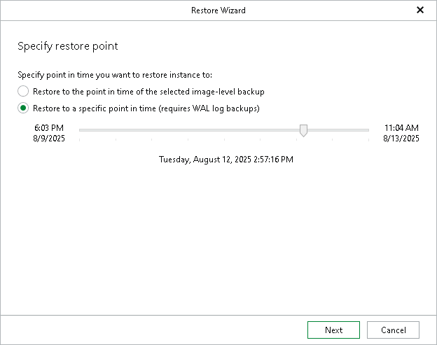

# Step 2. Specify Restore Point

In this article

At this step of the wizard, select a state as of which you want to recover your data:

* Select the Restore to the point in time of the selected image-level backup option to load instance files as of the moment when the current restore point was created.

* Select the Restore to a specific point in time option to obtain instance files as of the selected point in time within the available restore period. Use the slider to choose the point in time you need.

The Restore to a specific point in time option is available only if backups of PostgreSQL write ahead log (WAL) files exist. For more information, see [Required Job Settings](vep_bu_job_settings.md).

Note that if the backed-up WAL files do not contain information about some instances for the selected point in time, those instances will be recovered as of their latest available state.

Page updated 10/6/2025

Page content applies to build 13.0.1.1071
