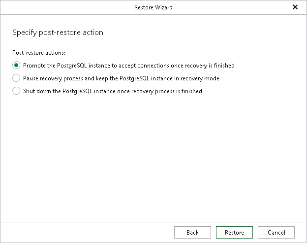

# Step 6. Specify Post-Restore Action

In this article

This step is available only if you have selected the Restore to a specific point in time option at the [Specify restore point](vep_restore_single_tas_specify_restore_point.md) step of the wizard.

At this step of the wizard, select a post-restore action that the PostgreSQL instance must take after the instance is restored.

1. Choose a post-restore action.

* Select Promote the PostgreSQL instance to accept connections once recovery is finished to make the PostgreSQL instance available for connections.
* Select Pause recovery process and keep the PostgreSQL instance in recovery mode to make the PostgreSQL instance run but not accepting incoming remote TCP connections.

To resume the paused state, use the pg\_wal\_replay\_resume() command:

|  |
| --- |
| psql -p <port> -c "SELECT pg\_wal\_replay\_resume();" |

where <port> is a port number of the PostgreSQL instance.

* Select Shut down the PostgreSQL instance once recovery process is finished to make the PostgreSQL instance stop upon recovery.

In this case, you will need to start the PostgreSQL instance manually:

1. Change or remove the recovery.signal configuration file.
2. Launch the PostgreSQL instance with the pg\_ctl command:

|  |
| --- |
| $ pg\_ctl start -D <data\_directory> |

where <data\_directory> is the data directory of the PostgreSQL instance.

For example:

|  |
| --- |
| $ pg\_ctl start -D /var/lib/pgsql/13/data |

1. Click Restore.

Page updated 8/13/2025

Page content applies to build 13.0.1.1071
