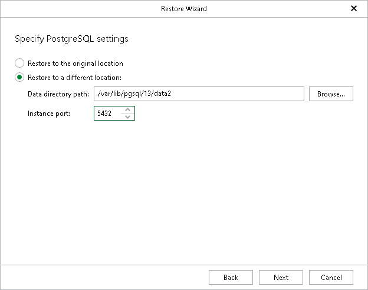

# Step 4. Specify PostgreSQL Settings

At this step of the wizard, specify the following PostgreSQL settings:

1. Specify a location to which you want to restore the PostgreSQL instance:

* Select Restore to the original location to restore the PostgreSQL instance to the original data directory.
* Select Restore to a different location and specify a path in the Data directory path field to restore the PostgreSQL instance to another directory. To locate a new directory, click Browse and select a folder you want to use.

1. In the Instance port field, specify an instance port, which will also serve as an instance identifier. The port must be free. If the specified port is occupied, the recovered PostgreSQL will be shut down.

To start the PostgreSQL instance manually, do the following:

1. Change the port number in the postgresql.conf file.
2. Launch the PostgreSQL instance with the pg\_ctl command:

|  |
| --- |
| $ pg\_ctl start -D <data\_directory> |

where <data\_directory> is a data directory of the PostgreSQL instance.

For example:

|  |
| --- |
| $ pg\_ctl start -D /var/lib/pgsql/13/data |

|  |
| --- |
| Note |
| If the target data directory is not empty, you will be prompted to overwrite it before proceeding to the next step. |

