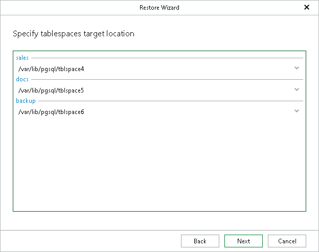

# Step 5. Specify Tablespaces

At this step of the wizard, specify paths of directories where database tables will be stored.

|  |
| --- |
| Note |
| If any of the target tablespace directories are not empty, you will be prompted to overwrite them before proceeding to the next step. |

