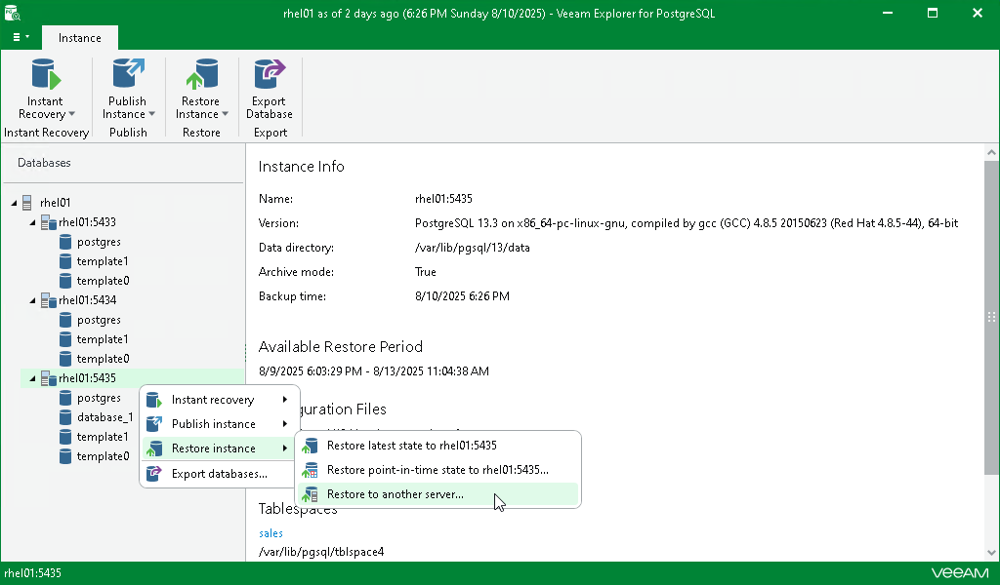

# Step 1. Launch Restore Wizard

In this article

To launch the Restore wizard, do the following:

1. In the navigation pane, select a PostgreSQL instance you want to restore.
2. On the Instance tab, select Restore Instance > Restore to another server.

Alternatively, you can right-click an instance and select Restore Instance > Restore to another server.

Page updated 8/13/2025

Page content applies to build 13.0.1.1071
