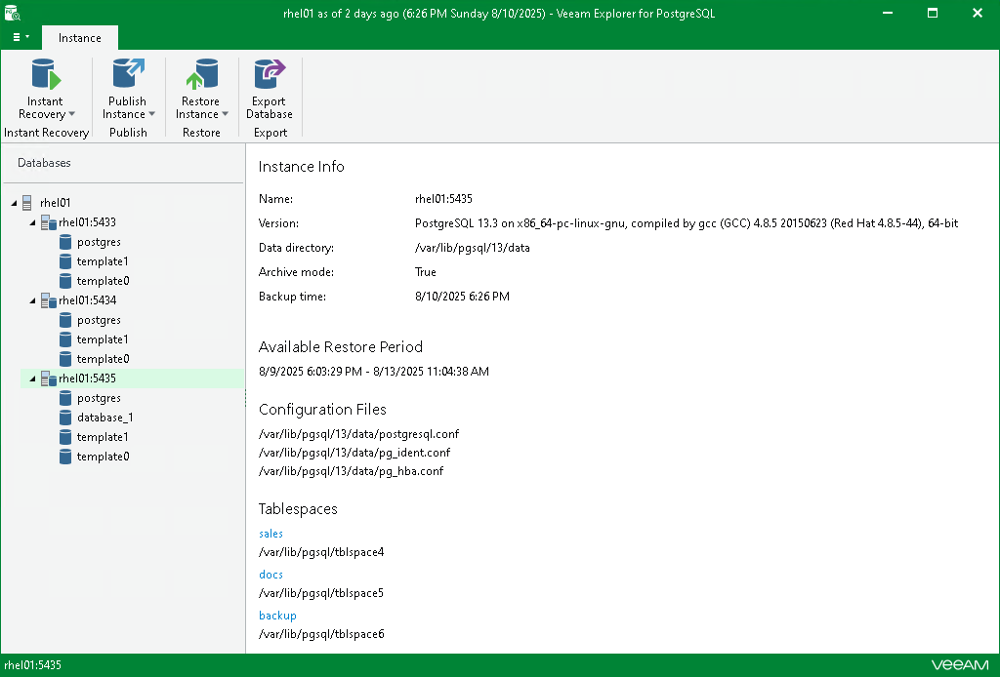

# Viewing Instance Information

In this article

To view PostgreSQL instance information, select an instance in the navigation pane and review its properties in the preview pane.

Page updated 8/13/2025

Page content applies to build 13.0.1.1071
