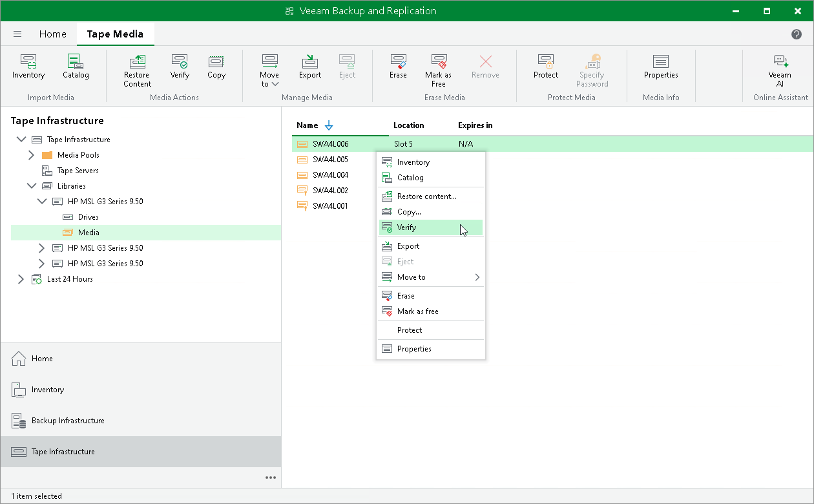

# Verifying Tapes

In this article

Veeam Backup & Replication offers a simple, yet efficient means to verify that your tapes are correctly read and consequently you can restore data stored on them in case of emergency.

|  |
| --- |
| Note |
| Consider the following:   * During the tape verification job, Veeam Backup & Replication only checks if the data on the tape can be read. It does not check the application consistency or infrastructure. * You can skip verifying tapes in a virtual tape library as in this case  Veeam Backup & Replication will retrieve no check sums for data blocks. |

Reasons for Tape Verification

There can be different reasons to verify your LTO tapes:

* You want to check tapes before copying their data to new tapes.
* LTO has great durability, but it is still limited, and after some time you need to replace the tape media with a new one.
* Compliance reasons.

How Tape Verification Works

Veeam Backup & Replication performs tape verification in the following way:

1. Veeam Backup & Replication instructs the tape drive to sequentially read data blocks from the tape and compares their content with the Veeam Backup & Replication database: it checks offsets of backup files, the correspondence of the offsets with correct file headers and the length of full backup files.
2. If the data on the tape does not correspond to the data in the Veeam Backup & Replication database, the latter is reported as corrupted (in the session log or separate .CSV file).
3. The tape drive calculates the checksums for data blocks on the tape and compares them with the checksums already stored for these data blocks on the tape.
4. If the drive detects an error in some data block (checksums differ or the data block could not be read), Veeam Backup & Replication reports all files in the data block as corrupted (in the session log or separate .CSV file).

Prerequisites for Tape Verification

Before starting a tape verification job, check the following prerequisites:

* The tapes to verify must be online.
* The tapes to verify must be cataloged. Tapes in the Unrecognized media pool are not available for tape verification. For more information, see [Cataloging Tapes](cataloging_tapes.md).
* All tapes to verify must be decrypted. Encrypted tapes cannot be read. For more information on decryption, see [Decrypting Tapes with Password](tape_decrypt_password.md).

Besides, note that you cannot run tape verification for cleaning tapes and free tapes (tapes in the Free media pool).

Running Tape Verification

To start the tape verification job:

1. Open the Tape Infrastructure view.
2. Navigate to the list of tapes either under Media Pools or under Libraries > LibraryName node > Media > Online.
3. Select a tape you want to verify and click Verify on the ribbon. Alternatively, you can right-click the selected tape and select Verify from the drop-down menu.

If you want to simultaneously use several drives for tape verification, successively start separate tape verification jobs for different tapes.

When writing backup files to tapes, there can be situations where a file does not fit on a tape. Then it is divided into parts and written to several tapes, which are then considered dependent. When verifying tapes, Veeam Backup & Replication checks data on selected tapes only. It does not check data on dependent tapes if they are not selected for verification.

To get an email report about the results of the tape verification job processing, enable notifications as described in [Configuring Global Email Notification Settings](general_email_notifications.md). If there are too many issues reported after verification, the job session log in Veeam Backup & Replication UI displays only first 10 files with errors. For a full list of read errors with detailed paths and tape IDs, open the detailed report in the CSV format stored in the folder where tape verification job logs are stored. For convenience, the path to this folder is specified in the job session log in UI and in the email report.

Page updated 11/5/2025

Page content applies to build 13.0.1.1071
