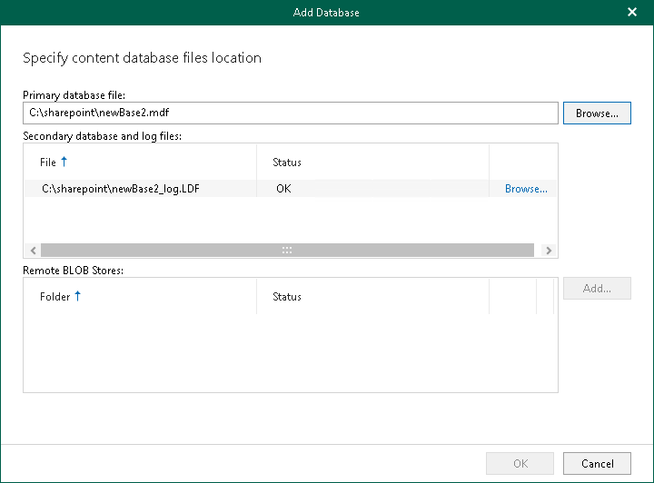

# Adding Microsoft SharePoint Databases

You can add Microsoft SharePoint databases to the application scope manually. For example, you may want to do this to restore items from a Microsoft SharePoint database exported earlier using Veeam Explorer for Microsoft SQL Server. For more information, see [Exporting as MDF](vesql_exporting_mdf.md).

When you add a standalone Microsoft SharePoint database to the application scope, Veeam Explorer for Microsoft SharePoint attaches the database to the staging SQL server, creating a temporary Microsoft SharePoint content database from which you can restore your items.

To manually add a Microsoft SharePoint database to the application scope, take the following steps:

1. Do one of the following:

* On the Home tab, click Add Database > Microsoft SharePoint database on the ribbon.
* Right-click the Databases node and select Add database.

1. Specify the location of the Microsoft SharePoint primary content database file (.mdf). The secondary database and the transaction log file (.ldf) will be added automatically. Keep in mind that shared folders and mapped network drives are not supported as a location for Microsoft SharePoint content database files.

To add remote BLOB stores, click Add next to the Remote BLOB Stores section.

1. Click OK.

