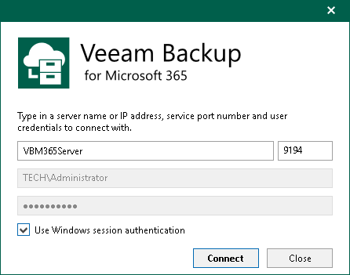

# Adding Veeam Backup for Microsoft 365 Server

In this article

You can use the built-in Veeam Explorer for Microsoft SharePoint abilities to connect to another Veeam Backup for Microsoft 365 server and add its databases to the Veeam Explorer for Microsoft SharePoint scope.

To connect to another Veeam Backup for Microsoft 365 server remotely, do the following:

1. Do one of the following:

* On the Home tab, click Add Database > Veeam Backup for Microsoft 365 server on the ribbon.
* Right-click the Databases node and select Veeam Backup for Microsoft 365 server.

1. Specify the DNS name or IP address of the Veeam Backup for Microsoft 365 server and enter credentials to access it.

Select the Use Windows session authentication check box to connect with the user account under which you are currently logged in.

1. Click Connect.

Page updated 3/5/2025

Page content applies to build 13.0.1.1071
