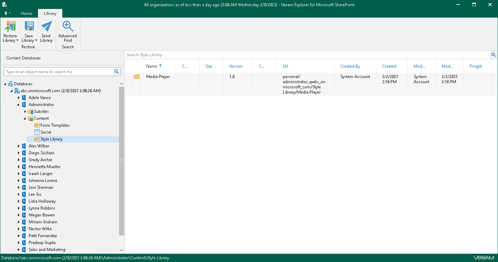
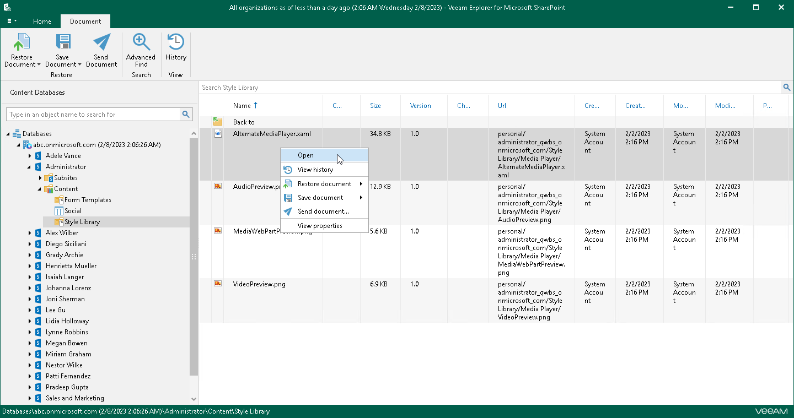
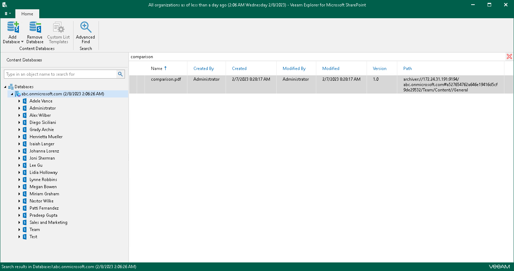
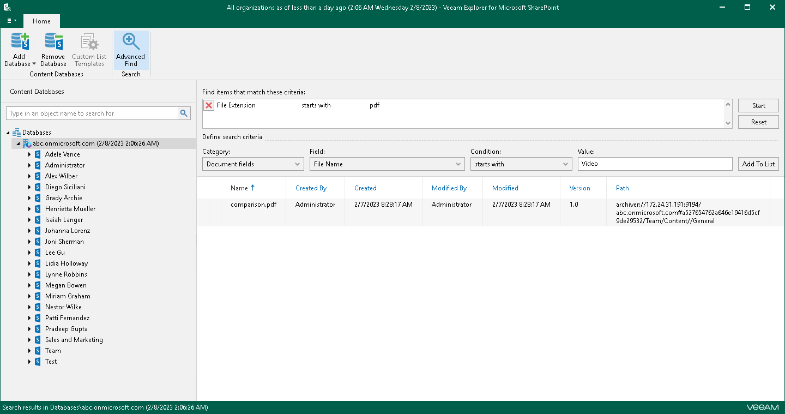

# Browsing, Searching and Viewing Items

In this article

You can use Veeam Explorer for Microsoft SharePoint to view the contents of a backup file, view object properties, open files, search for sites and for items in a backup file as well as customize criteria of your search.

Searching for Sites

You can use keywords to search for sites in the database structure containing your SharePoint objects. To do this, enter a search query in the search field at the top of the navigation pane.

To remove a keyword, click the cross mark.

Browsing Backup Content

To view the contents of a backup file, you use the navigation pane which shows you the database structure containing your site items such as libraries and subsites.

After you select an object in the navigation pane, you can see its content in the preview pane.

Viewing Objects Properties and Opening Files

To view object properties, right-click an object in the preview pane and select View properties.

To open a document using an associated application, right-click a document in the preview pane and select Open.

Searching for Objects in Backup File

The search mechanism allows you to find items matching specified search criteria.

To search for required items, do the following:

1. In the navigation pane, select an object in which you want to find data.
2. Enter a search query in the search field at the top of the preview pane.

Consider the following:

* You can use double quotes to find the exact phrase. For example, "media player".
* You can narrow search results by specifying various search criteria using the criteria:value format. For more information about search parameters, see the [Appendix A. Item Search Parameters](https://helpcenter.veeam.com/docs/vbo365/guide/appendix_search.html?ver=80) section of the Veeam Backup for Microsoft 365 User Guide. For example, status:pending approval.
* You can use logical upper-cased operators such as AND, OR and NOT along with wildcard characters such as \* and ?.

For example:

* meeting AND from:user@abc.onmicrosoft.com — returns objects that include both specified keywords.
* meeting OR from:user@abc.onmicrosoft.com — returns objects that include one of the specified keywords.
* NOT from:user@abc.onmicrosoft.com — excludes objects specified by a keyword.
* hasattachments:compar\* — returns all objects that contain an attachment and the attachment name is started with compar.
* ?all — returns all objects that contain the specified keyword with any alphabet in the first position.

Using Advanced Find

The Advanced Find mechanism allows you to define your search criteria more precisely.

Consider the following:

* Logical upper-cased operators such as AND, OR and NOT are not supported in the Value field. You can specify the text keyword only.
* You can create multiple filters. If you selected the same search criteria from the Category, Field or Condition lists, the OR operator is applied to process such filters. If the search criteria are different, the AND operator is applied.

For example, to find an object that starts with the word Video, do the following:

1. In the preview pane, select a node and click Advanced Find on the ribbon.
2. In the Define search criteria section, select Category > Document fields.
3. From the Field list, select File Name.
4. From the Condition list, select starts with.
5. In the Value field, specify a file name.
6. Click Add to List and then click Start.

To remove a filter, click the cross mark next to it. To remove all configured filters, click Reset.

Page updated 6/26/2025

Page content applies to build 13.0.1.1071
