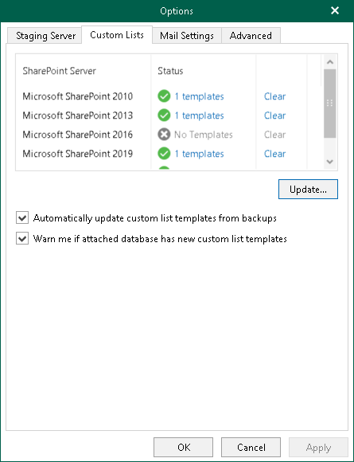
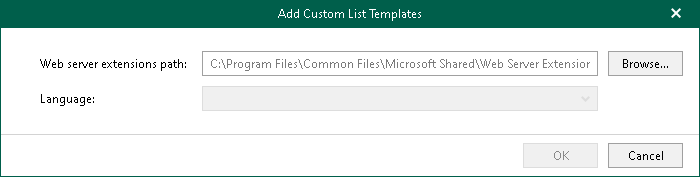
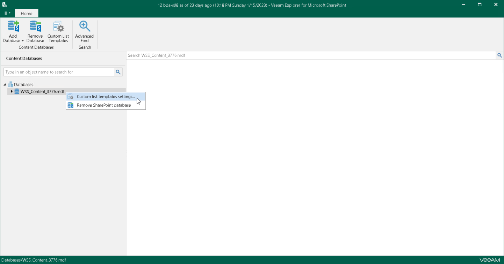
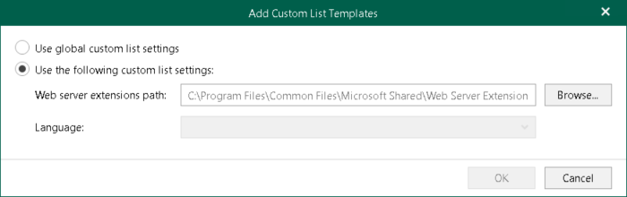

# Custom List Settings

In this article

Veeam Explorer for Microsoft SharePoint supports obtaining custom list templates from backups created by Veeam Backup & Replication. The actual information about templates is stored directly in a backup file and obtained automatically so that you can view the custom list data without having to perform any additional operations.

|  |
| --- |
| Note |
| Configuring custom lists is not required when working with backups created by Veeam Backup for Microsoft 365. |

To see templates with their names and features, do the following:

1. In the main menu, click General Options.
2. Open the Custom Lists tab.
3. Click the link under the Status column which also comprises the total number of available templates.
4. If you want to automatically update existing templates, select the Automatically update custom list templates from backups check box.
5. If you want to be notified whether the database contains new templates other than those you already have, select the Warn me if attached database has new custom list templates check box.

See the next figure showing you what custom list templates are available.

To remove templates, click Clear.

Importing Templates Manually

To import existing templates from a Microsoft SharePoint server manually, do the following:

1. In the main menu, click General Options.
2. On the Custom Lists tab, click Update.
3. Specify a path to Microsoft SharePoint templates, select a language and click OK. The language set in the drop-down list depends on the installed language packages on the SharePoint server.

Importing Templates Using Ribbon Menu

|  |
| --- |
| Note |
| Available only for Microsoft SQL Server databases and requires a staging SQL server. For more information on configuring a staging server, see [Staging SQL Server Settings](vesp_configuring_sql_settings.md). |

To import existing templates from the Microsoft SharePoint server, do one of the following:

* In the navigation pane, select a SQL database, and click Custom List Templates on the ribbon.

* In the navigation pane, right-click a SQL database and select Custom list templates settings.

1. Select how you want your templates to be applied:

* Select Use global custom list settings to apply global list templates to the select database.

* Select Use the following custom list settings to apply the templates to the selected database only.

When using the latter option, specify the path to the Microsoft SharePoint templates, select the language and click OK. The language set in the drop-down list depends on the installed language packages on a SharePoint server.

Page updated 9/18/2024

Page content applies to build 13.0.1.1071
