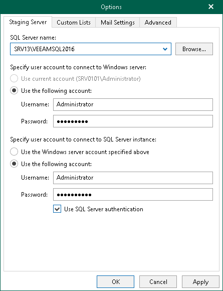
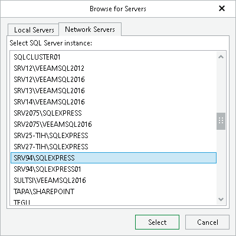

# Staging SQL Server Settings

To perform Microsoft SharePoint items restore, Veeam Explorer for Microsoft SharePoint requires a Microsoft SQL server to be used as a staging system.

Before you add a staging server, see the prerequisites in [Staging SQL Server](vesp_staging_microsoft_sql_server.md).

To configure a staging server, do the following:

1. In the Veeam Explorer for Microsoft SharePoint main menu, click General Options.
2. Open the Staging Server tab and do the following:

1. From the SQL Server name drop-down list, select an instance that you want to use as your staging server.

You can click Browse to locate an instance using the built-in browser, as described in [Browsing for Servers](#Browsing).

1. In the Specify user account to connect to Windows server section, select one of the following options:

* Use current account. To connect to the specified server using the current user account under which Veeam Explorer for Microsoft SharePoint running. This option is only available if you have selected a local Microsoft SQL Server instance as the staging server.
* Use the following account. To connect to the specified server under a custom user account.

When using a custom account, in the Username field, specify a user name and in the Password field, provide the password.

1. In the Specify user account to connect to SQL Server instance section, select one of the following options:

* Use the Windows server account specified above. To connect to the specified instance under the user account that you have specified in the Specify user account to connect to Windows server section.
* Use the following account. To connect to the specified instance under a custom user account.

When using a custom account, in the Username field, specify a user name and in the Password field, provide the password.

To use SQL Server authentication, select the Use SQL Server authentication check box.

1. Click OK to finish the configuration and close the window.

Browsing for Servers

To browse for an instance, perform one of the following actions:

* On the Local Servers tab, choose a Microsoft SQL Server instance that is located on the machine where Veeam Explorer for Microsoft SharePoint is opened and click Select.
* On the Network Servers tab, choose a Microsoft SQL Server instance available over the network and click Select.

