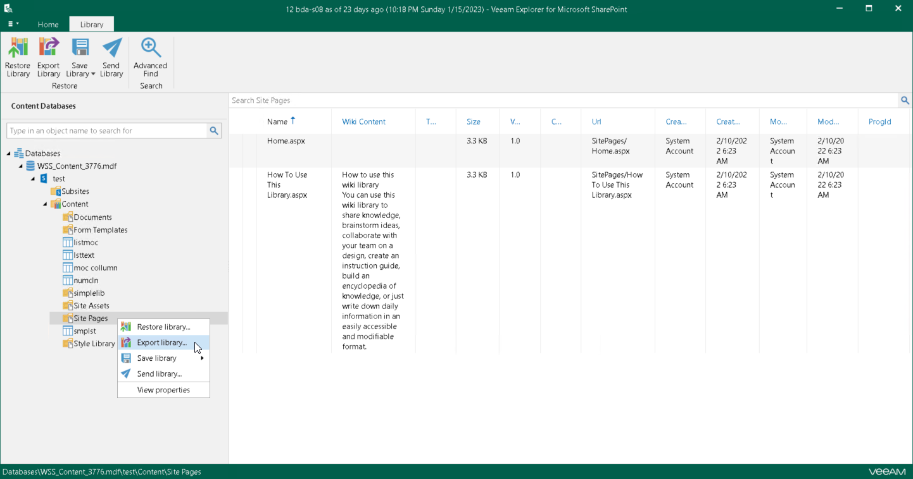

# Exporting Microsoft SharePoint Data

Veeam Explorer for Microsoft SharePoint allows you to export SharePoint document libraries and lists from backups created by Veeam Backup & Replication.

The exported content will be saved as a set of XML files and can be imported to another SharePoint database using PowerShell cmdlets. For more information, see [Importing Microsoft SharePoint Data](vesp_importing_exported_content.md).

To export a document library, do the following:

1. In the navigation pane, do one of the following:

* Select a document library that you want to export, and on the Library tab, click Export Library.
* Right-click a document library and select Export library.

1. Specify the output directory and click OK.

To export a list, do the following:

1. In the navigation pane, do one of the following:

* Select a list that you want to export, and on the List tab, click Export List.
* Right-click a list and select Export list.

1. Specify the output directory and click OK.

|  |
| --- |
| Note |
| You cannot export an empty folder, an empty list and an individual list item. |

