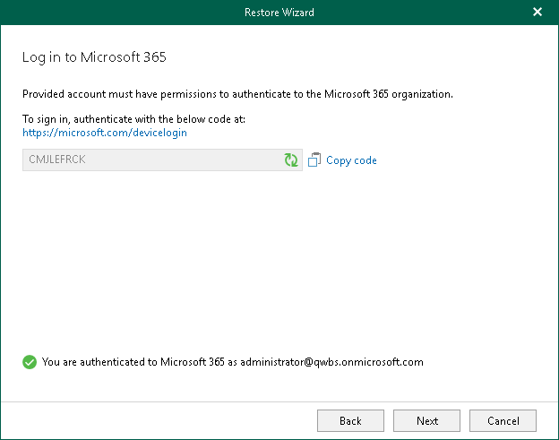

# Step 4. Log In to Microsoft 365

In this article

This step is only available if you have selected the Modern Authentication option at the [previous step](vesp_select_authentication_method_lib_m365.md) of the wizard.

At this step of the wizard, log in to your Microsoft 365 organization.

To log in to the Microsoft 365 organization, do the following:

1. Click Copy code to copy an authentication code.

Keep in mind that a code is valid for 15 minutes. You can click Refresh to request a new code from Microsoft.

1. Click the Microsoft Identity platform authentication server link.

A web browser window opens.

1. On the Sign in to your account webpage, paste the code that you have copied and sign in to Microsoft Identity platform.

Make sure to log in with the user account that has required permissions assigned. For more information, see [Permissions](vesp_permissions.md).

Make sure that the required settings are specified for the Microsoft Entra application used for restore. For more information, see the [Configuring Microsoft Entra Application Settings](https://helpcenter.veeam.com/docs/vbo365/guide/ad_application_settings_configuring.html?ver=80) section of the Veeam Backup for Microsoft 365 User Guide.

1. Return to the Restore Wizard window and click Next.

Page updated 8/22/2024

Page content applies to build 13.0.1.1071
