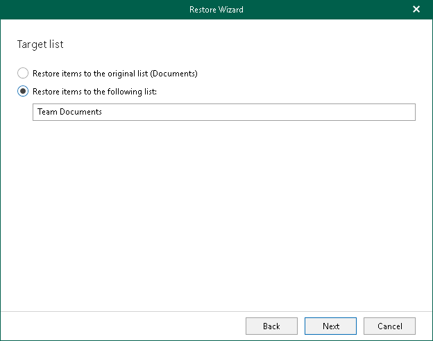

# Step 4. Specify Target List

At this step of the wizard, select whether you want to restore backed-up data to the original list or specify a custom list.

You can select one of the following options:

* Restore items to the original list. To restore the document or list item back to the original list.
* Restore items to the following list. To restore the document or list item to the specified list.

Make sure to specify a list that exists in the original SharePoint site.

