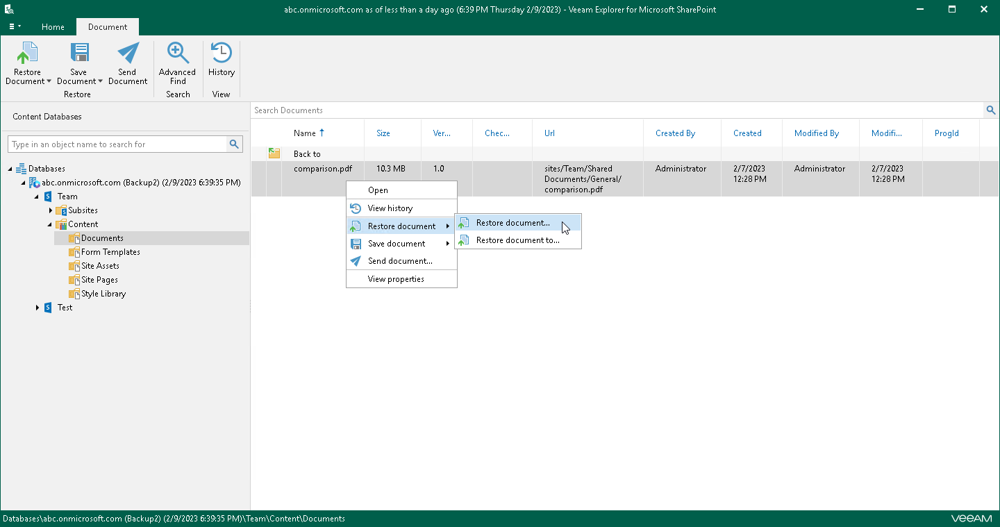

# Step 1. Launch Restore Wizard

To launch the Restore wizard for a document, do one of the following:

* In the preview pane, select a document that you want to restore, and on the Document tab, click Restore Document > Restore document to <library\_name>.

* In the preview pane, right-click a document and select Restore document > Restore document.

To launch the Restore wizard for a list item, do one of the following:

* In the preview pane, select a list item that you want to restore, on the Item tab, click Restore Item > Restore item to <list\_name>.

* In the preview pane, right-click a list item and select Restore item > Restore item.

