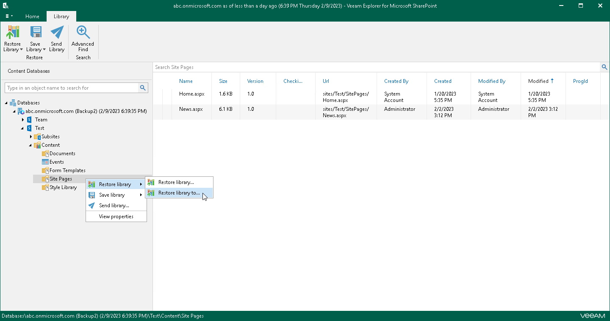

# Step 1. Launch Restore Wizard

To launch the Restore wizard for a document library, do one of the following:

* In the navigation pane, select a document library that you want to restore, and on the Library tab, click Restore Library > Restore library to.

* In the navigation pane, right-click a document library and select Restore library > Restore library to.

To launch the Restore wizard for a list, do one of the following:

* In the navigation pane, select a list that you want to restore, and on the List tab, click Restore List > Restore list to.

* In the navigation pane, right-click a list and select Restore list > Restore list to.

