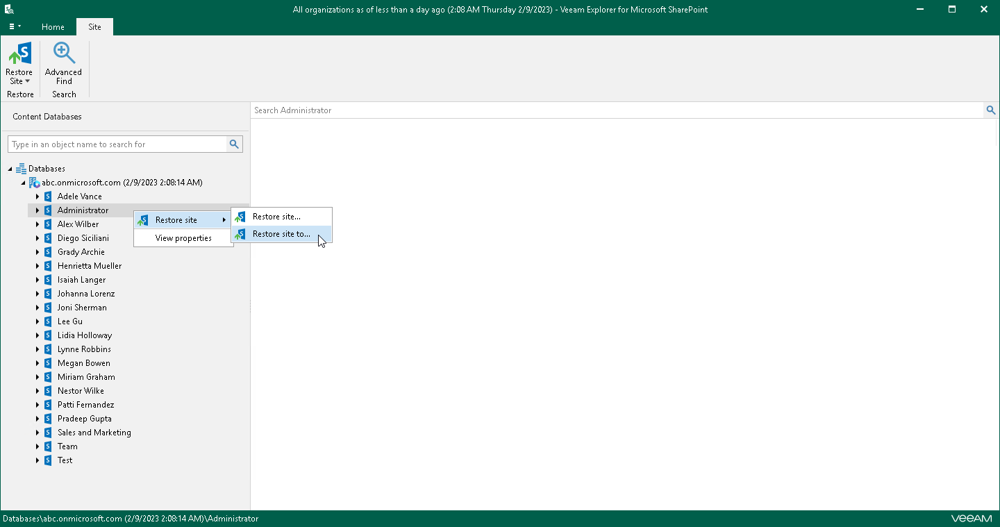

# Step 1. Launch Restore Wizard

In this article

To launch the Restore wizard, do one of the following:

* In the navigation pane, select a site that you want to restore, and on the Site tab, click Restore Site > Restore site to.

* In the navigation pane, right-click a site and select Restore site > Restore site to.

|  |
| --- |
| Note |
| When restoring sites to site collections, make sure that such collections exist in the target location; Veeam Explorer for Microsoft SharePoint does not create site collections. |

Page updated 9/18/2024

Page content applies to build 13.0.1.1071
