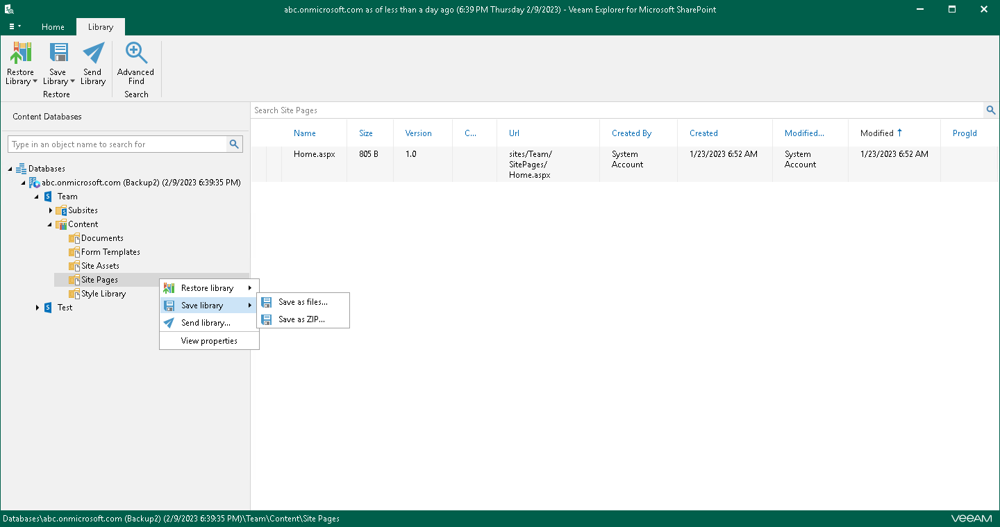

# Saving Microsoft SharePoint Documents and Libraries

Veeam Explorer for Microsoft SharePoint allows you to save your document libraries and library documents to a specified location.

To save a document library, do the following:

1. In the navigation pane, do one of the following:

* Select a document library that you want to save, and on the Library tab, click Save Library > Save as files or Save Library > Save as ZIP.
* Right-click a document library and select Save library > Save as files or Save library > Save as ZIP.

1. In the displayed window, browse to the necessary folder and click Select Folder or Save.

Keep in mind that if you select the Save as ZIP option, Veeam Explorer for Microsoft SharePoint will save a library to an archive with the archive.zip name.

To save a library document, do the following:

1. In the preview pane, do one of the following:

* Select a document that you want to save, and on the Document tab, click Save Document > Save as files or Save Document > Save as ZIP.
* Right-click a document and select Save document > Save as files or Save document > Save as ZIP.

1. In the displayed window, browse to the necessary folder and click Select Folder or Save.

Keep in mind that if you select the Save as ZIP option, Veeam Explorer for Microsoft SharePoint will save a library to an archive with the archive.zip name.

