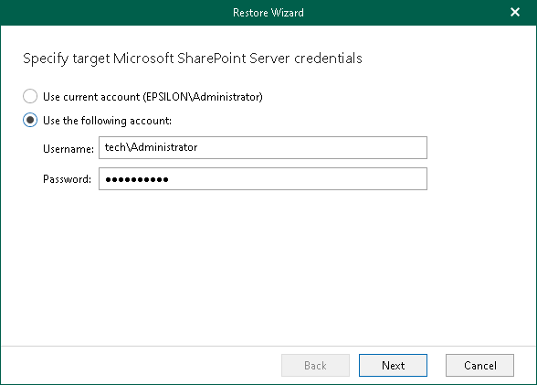

# Step 2. Select Authentication Method

In this article

At this step of the wizard, select either modern or basic authentication, or authenticate on an on-premises Microsoft SharePoint server, and specify authentication settings.

Modern Authentication

To use modern authentication, do the following:

1. From the Authentication method drop-down list, select Modern authentication.

This will allow Veeam Backup for Microsoft 365 to use a Microsoft Entra application for data restore. Such an application is used to restore the specified object back to Microsoft 365 organizations with enabled multi-factor authentication (MFA). For more information, see the [Adding Microsoft 365 Organizations](https://helpcenter.veeam.com/docs/vbo365/guide/vbo_add_office365_org.html?ver=80) section of the Veeam Backup for Microsoft 365 User Guide.

1. In the Application ID field, enter an identification number of the Microsoft Entra application that you want to use for data restore.

By default, Veeam Explorer for Microsoft SharePoint populates this field with the identification number of the application that was used during a backup session. If you want to use another application, make sure to grant this application required permissions. For more information, see the [Microsoft Entra Application Permissions](https://helpcenter.veeam.com/docs/vbo365/guide/azure_ad_applications.html?ver=80) section of the Veeam Backup for Microsoft 365 User Guide.

Basic Authentication

To use basic authentication, do the following:

1. From the Authentication method drop-down list, select Basic authentication.
2. In the Username and Password fields, enter credentials to connect to the SharePoint organization.

On-Premises Organizations

To authenticate on an on-premises Microsoft SharePoint server, use an account that you are currently logged in to or provide a user name and password.

Restoring from Microsoft SQL Server Database

Veeam Explorer for Microsoft SharePoint allows you to restore Microsoft SharePoint sites from a Microsoft SQL server database. You can get the database files directly from the original Microsoft SharePoint machine, or you can use Veeam Backup & Replication to restore guest OS files of the machine.

When restoring from a Microsoft SQL server database, provide the following:

* The site URL to which you want to restore your site.
* Authentication credentials.

|  |
| --- |
| Note |
| When restoring Microsoft SharePoint sites from a Microsoft SQL server database, you will proceed directly to the [Specify Restore Options](vesp_specify_restore_options_sites.md) step of the wizard. |

For more information on how to restore Microsoft SharePoint sites from a Microsoft SQL server database, see [Restoring Sites](vesp_vbr_restore_sites.md).

Page updated 2/14/2025

Page content applies to build 13.0.1.1071
