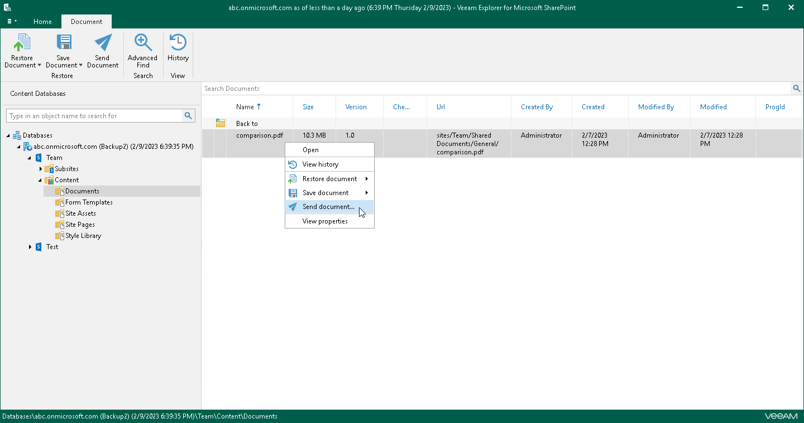
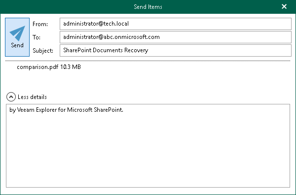

# Sending Microsoft SharePoint Documents and Libraries

Veeam Explorer for Microsoft SharePoint allows you to send libraries or library documents to the specified recipients by email.

|  |
| --- |
| Note |
| Before sending documents, make sure to configure mail settings. The amount of data you can send at a time depends on your SMTP server configuration. For more information about configuring mail settings, see [Mail Settings](vesp_mail_settings.md). |

To send SharePoint libraries or library documents by email, do the following:

1. Depending on the type of object you want to send, the following actions are available:

* To send a document library, do one of the following:

* In the navigation pane, select a document library that you want to send, and on the Library tab, click Send Library.
* In the navigation pane, right-click a document library and select Send library.

* To send a library document, in the navigation pane, select a document library that contains the document that you want to send, and then do one of the following:

* In the preview pane, select a library document, and on the Document tab, click Send Document.

* In the preview pane, right-click a library document and select Send document.

1. In the Send Items window, provide a recipient address.

The From field is filled automatically based on the address you have provided when configuring mail settings.

You can also edit the message subject and body. To edit the message body, click More details.

